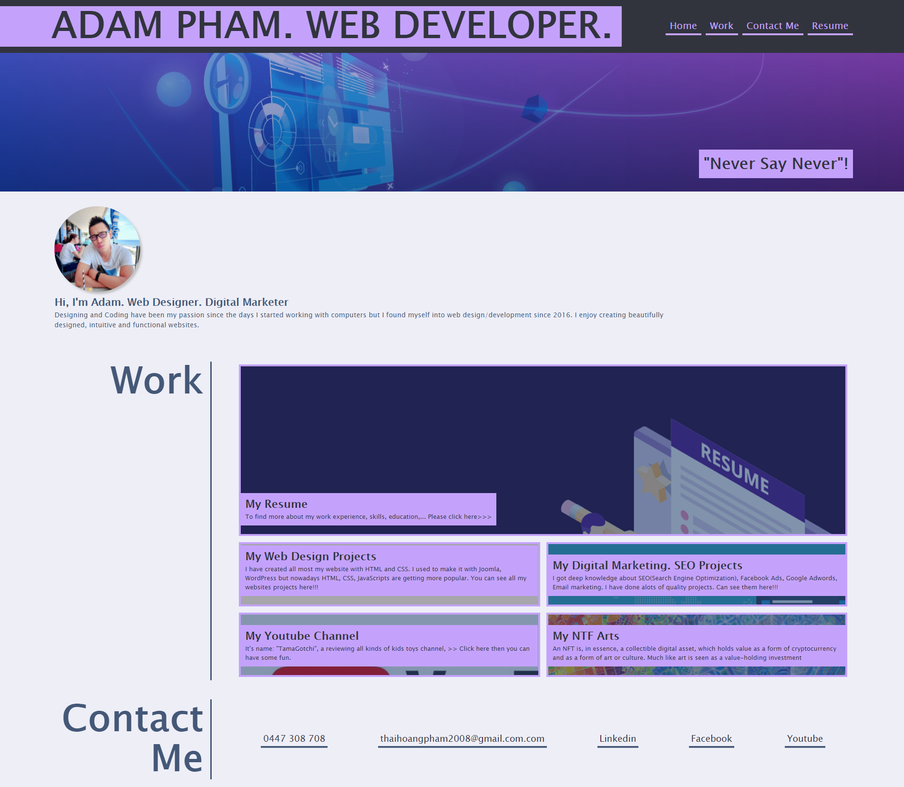

# Coursework2.Adam: Professional Portfolio
<h1 align="center">ADVANCED CSS: PORTFOLIO 🚩</h1>
<br>
<p align="center">
  <a href="#">
  
  <a href="#">
  
  <a href="#">
  
  <a href="#">
  
  <a href="#">
  
  <br>
  <a href="#">
  
  <a href="#">
  
  <a href="https://github.com/ThiHoangPham/professional-portfolio/blob/main/LICENSE">
  
  </a>
  <a href="#">
  
  <a href="#">
  
  </a>
  <a href="#">
  
  </a>
  <a href="#">
  
  </a>
  <a href="#">
  
  </a>
</p>
<hr>

  <h3 align="center">
    <p align="center">
      <a href="https://github.com/ThiHoangPham/professional-portfolio"><strong>Explore the docs »</strong></a>
      <br />
      <br />
      <a href="https://thihoangpham.github.io/professional-portfolio/">Demo</a>
      ·
      <a href="https://github.com/ThiHoangPham/professional-portfolio/issues">Report Bug</a>
      ·
      <a href="https://github.com/ThiHoangPham/professional-portfolio/issues">Request Feature</a>
    </p>
  </table>

  <details>
    <summary>Table of Contents</summary>
    <ul>
      <li><a href="#about-the-project">About The Project</a>
      <li><a href="#user-story">User Story</a></li>
      <li><a href="#acceptance-criteria">Acceptance Criteria</a></li>
      <li><a href="#live-demo-github">Live Demo</a></li>
      <li><a href="#contributor">Contributor</a></li>
      <li><a href="#contribution">Contribution</a></li>
      <li><a href="#license">License</a></li>
      <li><a href="#more-about-me">More About Me</a></li>
    </ul>
  </details>

  <br />

# About The Project
  A portfolio of work can showcase your skills and talents to employers looking to fill a part-time or full-time position. An effective portfolio highlights your strongest work as well as the thought processes behind it.

  

# User Story
```
AS AN employer
I WANT to view a potential employee's deployed portfolio of work samples
SO THAT I can review samples of their work and assess whether they're a good candidate for an open position
```

# Acceptance Criteria
```
GIVEN I need to sample a potential employee's previous work
WHEN I load their portfolio
THEN I am presented with the developer's name, a recent photo or avatar, and links to sections about them, their work, and how to contact them
WHEN I click one of the links in the navigation
THEN the UI scrolls to the corresponding section
WHEN I click on the link to the section about their work
THEN the UI scrolls to a section with titled images of the developer's applications
WHEN I am presented with the developer's first application
THEN that application's image should be larger in size than the others
WHEN I click on the images of the applications
THEN I am taken to that deployed application
WHEN I resize the page or view the site on various screens and devices
THEN I am presented with a responsive layout that adapts to my viewport
```

# Live Demo Github: 
<a href="https://thihoangpham.github.io/professional-portfolio/">
  
  </a>

# Contributor
<a href="https://github.com/ThiHoangPham/professional-portfolio">
  
  </a>

# Contribution
This how you can contribute to this project:
```
> Clone the project to your local 
> Create your own branch
> Add contribution codes/commit/push to remote repo
> Create a pull request
```
# License
  Distributed under the [MIT License](https://github.com/ThiHoangPham/professional-portfolio/blob/main/LICENSE)

# More About Me
  <a href="https://github.com/ThiHoangPham">
  
  <a href="https://thihoangpham.github.io/react-portfolio/">
  
  <a href="https://www.linkedin.com/in/thaihoangpham/">
  
  <a href="mailto:thaihoangpham2008@gmail.com">
  
  </br>
  <p align ="right"><a href="#">↥ back to top</a></p>

- - -

© 2021 Hoang Thai Pham(Adam): Advanced CSS - Portfolio